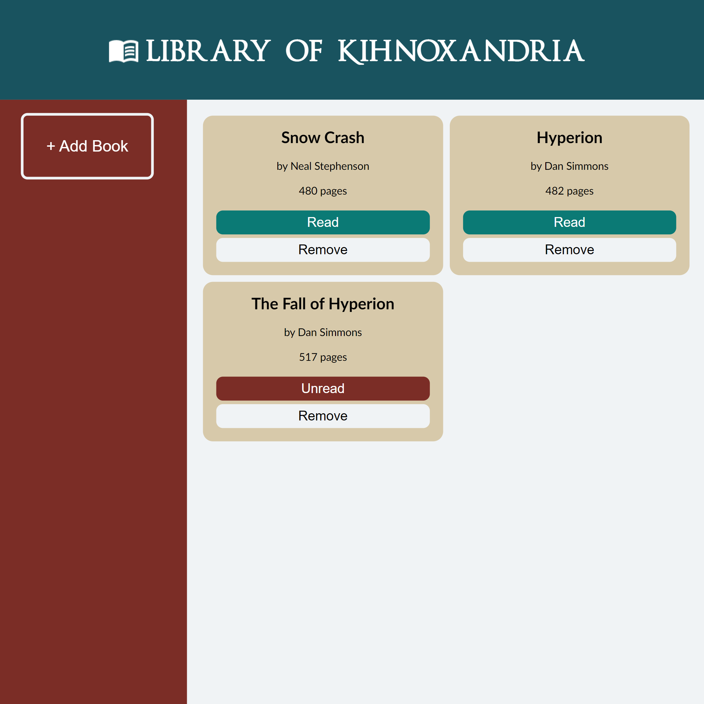

# Library App

https://kihno.github.io/library-app/

## Description

A library app for keeping track of your reading list.

## Built With

- HTML
- CSS
- Javascript
- Local Storage

## Features

- Store books in your library
- Set book to read/unread
- Library is saved in Local Storage

## Acknowledgements

Built as part of [The Odin Project](https://www.theodinproject.com/) full stack curriculm.